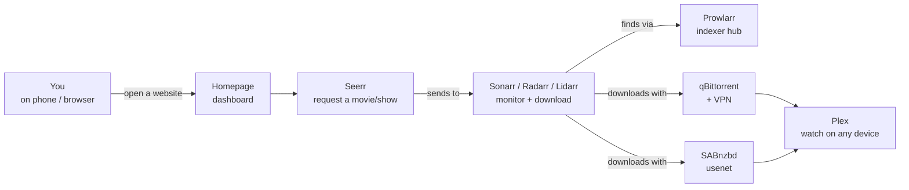

# Mediarr Installer — Beginner's Guide

A step-by-step tutorial for installing the Mediarr media stack on a Synology NAS,
written for people who have **never used Docker, SSH, or the command line**.

You will end up with your own personal Netflix-like setup that finds, downloads,
organises, and streams movies/TV/music to any device on your home network — all
hosted on your NAS.

> If you are comfortable with SSH and bash, the manual install path is in
> [`README.md`](./README.md). This guide uses the GUI installer (`Mediarr
> Installer.exe`) which does the same thing behind the scenes.

---

## Table of contents

1. [What you'll end up with](#1-what-youll-end-up-with)
2. [Before you start — the checklist](#2-before-you-start--the-checklist)
3. [Step 1 — Enable SSH on your NAS](#3-step-1--enable-ssh-on-your-nas)
4. [Step 2 — Download the installer](#4-step-2--download-the-installer)
5. [Step 3 — Run the installer](#5-step-3--run-the-installer)
   - [Welcome screen](#welcome-screen)
   - [Connect screen](#connect-screen)
   - [Env Detect screen](#env-detect-screen)
   - [Configure screen](#configure-screen)
   - [Run screen](#run-screen)
   - [Done screen](#done-screen)
6. [Step 4 — First-time setup for each service](#6-step-4--first-time-setup-for-each-service)
7. [Step 5 — Add your first movie or TV show](#7-step-5--add-your-first-movie-or-tv-show)
8. [Where things live (a quick map)](#8-where-things-live-a-quick-map)
9. [Help — something went wrong](#9-help--something-went-wrong)

---

## 1. What you'll end up with



After the installer finishes, you'll have a row of bookmarkable URLs on your home
network — one for each "service" — plus a dashboard that links to all of them.
You request something in **Seerr**, it gets downloaded, sorted, and shows up in
**Plex** automatically a few minutes (or hours) later.

### What each container does (in plain English)

The stack is made up of a dozen-ish small services ("containers"). You almost
never touch them directly — they talk to each other behind the scenes. Here's
the cheat sheet, sorted by which ones you'll actually open:

| Container | What it is | What it does, plainly |
|-----------|------------|----------------------|
| **Plex** | The TV | What you actually watch on. Open it on your phone / smart TV / laptop / browser. Streams everything your library has. |
| **Seerr** | The Netflix-style request page | What you (and family/friends) browse to ask for a new movie or show. Click "request" and the rest of the stack figures out how to get it. |
| **Homepage** | The home page | One web page that links to every other service so you don't have to remember any of these URLs. Bookmark this. |
| **Sonarr** | The TV-show librarian | You add a show once ("I want all of Breaking Bad"). Sonarr remembers every episode, watches for new ones as they release, finds them, hands them off to a downloader, and files them away when they arrive. |
| **Radarr** | Same, but for movies | Identical pattern: pick a movie, Radarr handles the rest. |
| **Lidarr** | Same, but for music | Pick an artist or album, Lidarr keeps the discography current. |
| **Bazarr** | The subtitle hunter | After Sonarr / Radarr brings in a video, Bazarr goes looking for matching subtitles (in your language) so you don't have to search yourself. |
| **Prowlarr** | The indexer phonebook | Sonarr / Radarr / Lidarr don't know where to *search* for releases — Prowlarr is the central list of "search engines for releases." You add a new indexer in Prowlarr and every arr picks it up automatically. |
| **qBittorrent** | The torrent downloader | Pulls files from a peer-to-peer network. Always runs *inside* Gluetun's network so your home IP is never exposed. The wizard wires this up; you just set a password. |
| **Gluetun** | The VPN wrapper | Acts as a sealed envelope around qBittorrent. All torrent traffic exits through your VPN provider. If the VPN drops, qBit can't reach anything — no IP leaks. You only see this container if you enabled VPN in the wizard. |
| **SABnzbd** | The usenet downloader | Pulls files from Usenet — faster + more reliable than torrents, but requires a paid provider (Eweka, Newshosting, etc.). Optional. |
| **Tautulli** | The watch-stats dashboard | Pretty graphs of what's been watched, by whom, for how long. Sends optional notifications. Talks only to Plex. |
| **Recyclarr** | The quality-rules keeper | The TRaSH Guides community publishes "use these rules for the best 1080p / 4K experience." Recyclarr automatically pushes those rules into Sonarr / Radarr so you get the right quality without having to copy-paste hundreds of settings. Has no UI of its own — the sidecar below provides one. |
| **recyclarr-trigger** | The Recyclarr + image-update web UI | Tiny webhook server at `http://<NAS>:8889`. Two pages: `/` is Recyclarr — **profile dropdowns** (pick a different TRaSH bundle without re-running the installer) plus a **Sync Now** button. `/pull` is **Update Images** — pulls newer image layers for every container in your stack via the Docker API, without recreating any container (no downtime). Both reachable from the Homepage dashboard's Maintenance row. |
| **Unpackerr** | The auto-unzipper | Some downloads arrive as `.rar` archives split into 50 files. Unpackerr extracts them in place so Sonarr / Radarr can see the actual video file. |
| **Flaresolverr** | The CloudFlare lock-picker | Some indexer sites (e.g. 1337x) hide behind a "are you human?" CloudFlare challenge. Flaresolverr solves the challenge so Prowlarr can still talk to them. Set-and-forget background service. |

**The shortest version of the whole stack:** *Seerr* takes requests → *Sonarr / Radarr / Lidarr* watch for what you want → *Prowlarr* tells them where to look → *qBittorrent + Gluetun* and *SABnzbd* download it → *Unpackerr* unpacks it if needed → *Bazarr* fetches subtitles → *Plex* plays it. *Homepage* is the dashboard linking to everything; *Tautulli* shows watch stats; *Recyclarr* keeps quality settings sane.

---

## 2. Before you start — the checklist

You need:

| Item | Why | Where to get it |
|------|-----|-----------------|
| **A Synology NAS** running DSM 7 or newer | This is what hosts everything | If you don't have one, this guide isn't for you (yet) |
| **A Windows, Mac, or Linux PC** | To run the installer from | The PC you're reading this on works |
| **Your NAS's IP address** on your home network | The installer needs to find it | DSM → Control Panel → Network — the LAN IP is shown |
| **Your NAS admin password** | To log in over SSH | Same one you use to sign into DSM |
| **About 30 minutes of patience** | First-time install downloads a lot of Docker images | — |

Optional but recommended:

| Item | Why | Where to get it |
|------|-----|-----------------|
| **A Plex account** | To stream your library | https://plex.tv (free) |
| **A VPN subscription** | Privacy for torrent traffic | NordVPN, Proton, Mullvad, AirVPN, or Surfshark all work |
| **A Usenet provider account** | Faster, more reliable downloads than torrents | Eweka, Newshosting, UsenetServer, etc. (paid) |
| **An indexer or two** | Where the *arr apps find releases | Prowlarr ships with public indexers built-in; for private, see [Step 4](#6-step-4--first-time-setup-for-each-service) |

> **You don't need any of the optional items to start.** The installer ships with
> free public indexers and you can turn off the VPN/qBittorrent profile if you
> only want usenet (or no torrents at all).

---

## 3. Step 1 — Enable SSH on your NAS

> **What's SSH?** Short for "Secure Shell." It's how the installer talks to your
> NAS to run commands. Think of it like the installer remotely typing into your
> NAS's keyboard. You enable it once and forget about it.

1. Open your NAS's web interface. (In your browser, go to
   `http://<your-nas-ip>:5000` — e.g. `http://192.168.1.242:5000`.)
2. Click **Control Panel**.
3. Find **Terminal & SNMP** (it's near the bottom of the list — you may need
   to enable "Advanced Mode" using the toggle at the top of Control Panel to
   see it).
4. Check the box for **Enable SSH service**.
5. Leave the port as `22`.
6. Click **Apply**.

That's it. You can close the browser tab.

---

## 4. Step 2 — Download the installer

1. Go to the **Releases** page of this repository.
2. Find the latest release (the one at the top).
3. Under "Assets," download the file that ends in `.zip` for Windows
   (or `.dmg` for macOS / `.AppImage` for Linux).
4. Right-click the downloaded ZIP → **Extract All...** → pick any folder
   you like (your Desktop is fine for a first install).
5. Open the extracted folder. You'll see a file named **`Mediarr Installer.exe`**.

> **Windows SmartScreen warning:** The first time you double-click the .exe,
> Windows will say *"Windows protected your PC"*. Click **More info** →
> **Run anyway**. This happens because the .exe isn't signed by a corporate
> certificate (signing costs hundreds of dollars per year). If you'd rather
> verify before running, you can check the SHA-256 hash listed on the release
> page against the file you downloaded.

---

## 5. Step 3 — Run the installer

Double-click `Mediarr Installer.exe`.

The installer is a multi-screen wizard with a big green hero icon at the
top of each screen, a stepper rail showing where you are, and a Help
button in the bottom-right corner that opens a searchable list of fixes
for every common problem. Here's what each screen does and what you
should fill in. ASCII art shows the rough layout — your actual window
has friendly icons + animations.

### Welcome screen

```
┌─────────────────────────────────────────────────────────┐
│  [🖥]  Welcome back                                     │
│         Pick a NAS to set up — or start fresh.          │
│                                                         │
│   ── Your NAS profiles ──         + New · ⬇ Import      │
│   ┌─────────────────────────────────────────────────┐   │
│   │ [DS]  DS1522+                  ┌─────────────┐  │   │
│   │       heoki@192.168.1.242:22   │ ▶  Install  │ ⚙│   │
│   │       ✓ config saved           └─────────────┘  │   │
│   └─────────────────────────────────────────────────┘   │
│                                                         │
│   ── Before you begin ──                                │
│    [🖥] SSH is enabled on the NAS                       │
│    [📦] Docker (Container Manager) is installed         │
│    [👤] (Optional) An account at plex.tv                │
└─────────────────────────────────────────────────────────┘
```

**First run:** the profile list is empty. The wizard shows a centered
"Let's set up your first NAS" card with two buttons — **Create your first
profile** and **Import from a file**.

**Returning runs:** click the green **Install** button on the profile
you want to set up. The little gear icon on each row opens an overflow
menu with the other actions:

- **Edit** — jump straight to the Configure screen with the saved values.
- **Update** — pull newer container images for an existing install
  without redoing everything.
- **Migrate** — bring an existing Sonarr/Radarr library across from
  another instance.
- **Export** — save the profile to an encrypted `.mediarr-profile.json`
  file (passphrase-protected).

Profiles are encrypted at rest with Electron's built-in `safeStorage`.

---

### Connect screen

```
┌─────────────────────────────────────────────────────────┐
│  [🔌]  Connect to your NAS                              │
│         On Synology: Control Panel → Terminal → SSH     │
│                                                         │
│   Host:      [ 192.168.1.242             ]  Port: [22]  │
│   User:      [ heoki                                 ]  │
│                                                         │
│   Authentication                                        │
│    [ 🔒 Password ]  [ 🔑 Private key ]                  │
│                                                         │
│   Password:  [ ●●●●●●●●●●●●●                  ] [ 👁 ]  │
│                                                         │
│   ┌── Back ──┐         ┌── 🛡 Test ──┐  ┌── Continue ──┐│
│   └──────────┘         └──────────────┘  └─────────────┘│
└─────────────────────────────────────────────────────────┘
```

Fill in:

- **Host** — your NAS's LAN IP (e.g. `192.168.1.242`). If you don't know it:
  - **Windows:** open Command Prompt → `arp -a` → look for a manufacturer
    like Synology.
  - **Or check your router's admin page** — it'll list connected devices
    by name.
- The wizard accepts pasted DSM URLs (e.g. `http://192.168.1.242:5000`)
  and strips the scheme + port automatically. It'll also warn you if you
  type port 80/443/5000/5001 — those are DSM's web ports, not SSH (which
  is 22).
- **Port** — leave as `22`.
- **User** — your DSM admin username.
- **Authentication** — click the **Password** or **Private key** pill.
  The wizard handles both. The little 👁 icon in the password field
  lets you peek at what you typed.
- **Sudo password** *(only if you're not logging in as root)* — appears
  below in an amber-tinted box. Leave blank to reuse the SSH password.

Click **Test** first — the wizard will verify the SSH credentials without
opening a persistent session. You'll see a green ✓ "Connection
successful" banner, after which the **Continue** button lights up green.
Click Continue to open the SSH session and advance to Env Detect.

**Common stumbles:**

- *"Authentication failed"* → wrong username or password.
- *"Connection refused"* → SSH isn't enabled, OR the firewall is blocking port
  22. Check Step 1.
- *"No route to host"* → wrong IP, or the PC and the NAS aren't on the same
  network.

---

### Env Detect screen

```
┌─────────────────────────────────────────────────────────┐
│  [📡 ↻]  Scanning your NAS…                             │
│           Looking up Docker, your user IDs, timezone…   │
│                                                         │
│   Detected NAS  Synology DSM  7.2.2                     │
│      Install dir: /volume1/docker/media                 │
│      Data root:   /volume1/Data                         │
│                                                         │
│   Required                                              │
│      ✓  Docker                v2                        │
│      ✓  /volume1 exists       /volume1 (Synology)       │
│      ✓  python3               /usr/bin/python3          │
│      ✓  iptables              /sbin/iptables            │
│                                                         │
│   Capacity & connectivity                               │
│      ✓  Disk space            842 GiB free of 4096 GiB  │
│      ✓  Image pulls           verified reachable        │
│                                                         │
│   Auto-filled                                           │
│      ✓  Timezone              America/New_York          │
│      ✓  LAN IP                192.168.1.242             │
│         Detected interfaces (click to use):             │
│         [ 192.168.1.242 ]  [ 100.64.0.42 (Tailscale) ]  │
│                                                         │
│   ┌── Back ──┐    ✓ All required checks passed          │
│                                ┌── Continue → ──┐       │
│                                └─────────────────┘      │
└─────────────────────────────────────────────────────────┘
```

The Radar icon spins slowly while the scan is in flight, then settles
once results land. Each check has a Lucide CheckCircle2 (green) or
XCircle (red) icon so you can tell pass / fail in shape, not just colour
— useful if you're colour-blind or have a dim screen.

**You don't need to do anything here — just click Continue** if every
required check is green.

If anything is red or amber, the screen explains exactly what to do
(e.g. "Create the Data shared folder in DSM → Control Panel → Shared
Folder → Create"). The wizard also detects:

- **Existing installs** — a sky-blue "An install already exists" banner
  appears with a **Switch to Update mode** button if you've installed
  here before.
- **Already-running services** — if Plex / Sonarr / Radarr are already
  running, an amber "Services already running — keep them?" panel lets
  you tick which ones the wizard should leave alone.
- **Port conflicts** — a red panel surfaces any port already bound by
  something else (with a specific fix for Synology Media Server squatting
  on port 49152).
- **DSM-7 platform quirks** — missing tun module, unloaded iptables
  modules, install dir on a network filesystem. Each comes with the
  exact fix command.

---

### Configure screen

This is the longest screen but the wizard pre-fills sensible defaults.
You only need to touch a few sections. Every section header has a small
tinted icon (Boxes, Award, Shield, HardDrive, UserCircle, KeyRound,
Lock, Wrench) so you can find a section at a glance instead of reading
each heading.

A small **Saving… → Saved ✓** chip appears in the profile pill at the
top whenever you change a field — your edits persist automatically and
you'll see proof of it.

```
┌─────────────────────────────────────────────────────────┐
│  [⚙]   Make it yours                                    │
│         We pre-filled what we could from the scan.      │
│                                                         │
│   [📦] Services  (10 of 10 enabled — Prowlarr always on)│
│     ☑ Plex stack    ☑ Sonarr     ☑ Radarr               │
│     ☑ Lidarr        ☑ Bazarr     ☑ qBittorrent          │
│     ☑ SABnzbd       ☑ Homepage   ☑ Recyclarr            │
│     ☑ Unpackerr                                         │
│                                                         │
│   [🏆] TRaSH Guide profiles                             │
│     Sonarr:  [ WEB-1080p     ▾ ]                        │
│     Radarr:  [ HD Bluray+WEB ▾ ]                        │
│                                                         │
│   [🛡] VPN  ▾                                            │
│                                                         │
│   [💾] Install location                                  │
│     Install dir   [/volume1/docker/media             ]  │
│     Data root     [/volume1/Data                     ]  │
│                                                         │
│   [👤] Identity                                          │
│     User    [ heoki    ▾ ]   Group   [ users   ▾ ]      │
│                                                         │
│   [🔑] Arr Web UI auth                                   │
│     Username  [ admin                                 ] │
│     Password  [ ●●●●●●●●●●●●●●●●           ] [ 👁 ]     │
│                                                         │
│   [🔒] qBittorrent WebUI                                 │
│     User      [ admin                                 ] │
│     Password  [ ●●●●●●●●●●●●●●●●           ] [ 👁 ]     │
│                                                         │
│   [🔧] Advanced  ▾                                       │
│        — usenet provider, indexer keys, private tracker │
│          logins, subtitle providers                     │
│                                                         │
│   ┌── ← Back ──┐               ┌── Continue → ──┐       │
│   └────────────┘               └─────────────────┘      │
└─────────────────────────────────────────────────────────┘
```

**What to fill in (in order of importance):**

1. **Services** — uncheck anything you don't want. If you don't have a Plex
   account, uncheck "Plex stack." If you only do usenet, uncheck qBittorrent.
   If unsure: leave them all on; you can turn things off later.

2. **TRaSH Guide profiles** — these set the quality bar for your downloads.
   Defaults are fine. If you have lots of storage and want 4K, pick UHD; for
   anime, pick Anime. (See [Recyclarr docs](https://recyclarr.dev) for what
   each profile does.)

3. **Plex claim token** — this is what links your Plex container to your Plex
   account. **It expires after 4 minutes**, so do this LAST before clicking
   Continue:
   - Open https://plex.tv/claim in a new browser tab.
   - Sign in if needed.
   - Copy the `claim-XXXX...` code shown on the page.
   - Paste it into the Plex claim token field in the wizard.

4. **qBittorrent password** — pick any password (at least 8 characters). You'll
   use this to log into qBittorrent's web UI later.

5. **VPN** *(optional — skip if you don't have a VPN account)*:
   - Click the VPN section to expand it.
   - Pick your provider (NordVPN / Proton / Mullvad / AirVPN / Surfshark).
   - Fill in the credentials per the prompts. The wizard tells you exactly
     where to find each value (e.g. "from your provider's WireGuard config
     download").

6. **Indexers** *(optional — skip on first install; you can add them later)*:
   - Click to expand if you have private indexer accounts.
   - For usenet: paste the API keys for the indexers you have accounts on.
   - For trackers: fill in user/password (or cookie for IPTorrents).

7. **Identity** — usually fine as-is. This is which Linux user inside the
   containers owns the files. The dropdown lists every user on your NAS.

Click **Save & Continue**.

---

### Run screen

```
┌─────────────────────────────────────────────────────────┐
│  Installing the stack                                   │
│  [🚀] Applying firewall rules…                          │
│  ████████████████░░░░░░░░░░░░░░░░░░░░  40% · step 4/10  │
│                                                         │
│   ✓  Step 1  Set file permissions                       │
│   ✓  Step 2  Create data and config directories         │
│   ✓  Step 3  Apply firewall rules                       │
│   ↻  Step 4  Fetch NordVPN WireGuard key       ← here   │
│      Step 5  Validate configuration                     │
│      Step 6  Start the stack                            │
│      Step 7  Configure all services                     │
│      Step 8  Add Prowlarr indexers                      │
│      Step 9  Enable Bazarr subtitle providers           │
│      Step 10 Verify stack health                        │
│                                                         │
│   ┌── 📋 Copy log · 💾 Save log… ───────────────────┐    │
│   │ [VPN] Fetching WireGuard key from NordVPN API… │    │
│   │ [VPN] Got key in 1.4s                          │    │
│   │ ...                                            │    │
│   └────────────────────────────────────────────────┘    │
│                                                         │
│   ┌── ← Back ──┐  ┌── ↻ Retry ──┐  ┌── Continue → ──┐   │
│   └────────────┘  └─────────────┘  └─────────────────┘  │
└─────────────────────────────────────────────────────────┘
```

This screen runs the actual install. **Just wait.** First time takes
15–25 minutes because Docker has to download about 3 GB of images.

The animated headline at the top changes as each phase begins (uploading
→ writing .env → running setup). The progress bar fills with a gentle
shimmer animation on its leading edge — you can see the install is alive
even when the log is quiet. Steps tick over from grey → amber-spinning →
green-check. If any step fails it goes red and a banner above the
stepper appears with two buttons (**N failed** / **N need action**),
each opening a tabbed details modal.

**If the install pauses:** the headline softens to "Install paused" and
the Retry button promotes to primary green. Tap Retry to run the whole
install again (your config is already saved), or Back to tweak a setting
first. Hovering any finished step in the rail reveals a small
**re-run** button so you can re-run just that step without redoing the
whole install.

**While you wait:** open https://plex.tv/claim in another tab, generate
a new claim token, and keep it handy — Plex will need it. The wizard
has a "Refresh Plex claim" panel that appears on pause, so you can
paste a fresh token directly there if needed.

---

### Done screen

```
┌─────────────────────────────────────────────────────────┐
│                                                         │
│                        [ ✓ ]                            │
│                                                         │
│                    You did it!                          │
│       Your media stack is live. Click any service       │
│              below to open it.   🎉 (confetti)          │
│                                                         │
│              ┌── ↻ Re-check health ──┐                  │
│                                                         │
│   ┌──────────────────┐  ┌────────────────────┐          │
│   │ ✓ Homepage [Start]│  │ ✓ Plex             │          │
│   │   :3000   →       │  │   :32400/web      → │          │
│   └──────────────────┘  └────────────────────┘          │
│   ┌──────────────────┐  ┌────────────────────┐          │
│   │ ✓ Sonarr   :49152│  │ ✓ Radarr   :49151  │          │
│   └──────────────────┘  └────────────────────┘          │
│   ... (Lidarr, Prowlarr, Bazarr, SABnzbd,               │
│        qBit, Seerr, Tautulli, Flaresolverr)             │
│                                                         │
│   ▾ Validation log  (exit 0)        📋 Copy · 💾 Save  │
│                                                         │
│   exit 0       ✓ All 12 services reachable              │
│                                  ┌── ↺ Start over ──┐   │
└─────────────────────────────────────────────────────────┘
```

A big green checkmark draws itself in over ~1s, then a quick confetti
burst celebrates the install. The headline says **"You did it!"** if
all services came up cleanly, or **"Setup complete"** with a different
status banner if some need attention.

Each service tile shows:

- **CheckCircle2** (green) — service responded on its port.
- **XCircle** (red) — service didn't respond. Tile hover highlights the
  service in rose so you can spot it.
- **Circle** (slate) — validation still running.

Click any tile to open that service in your browser. The **Homepage**
tile has a small "Start" badge — bookmark that URL; it's your one-stop
dashboard with tiles linking to everything else.

---

## 6. Step 4 — First-time setup for each service

Most services Just Work after the wizard. A few need one more click to come
fully online. Open each URL in order:

### Plex

- Open `http://<nas-ip>:32400/web`.
- If you used a fresh claim token: you're signed in, name the server, finish
  the wizard.
- If the claim token expired during install: Plex shows an unclaimed setup
  screen — sign in with your Plex account, name the server, claim it.
- **Add libraries:** Settings → Manage → Libraries → Add Library:
  - Movies → `/media/Movies`
  - TV Shows → `/media/TV Shows`
  - Music → `/media/Music`
  - (Add more for Anime if you use them.)

### Seerr (request portal)

- Open `http://<nas-ip>:5056`.
- The first time it loads it shows its own setup wizard.
- **Plex step:** sign in with the Plex account that owns your server, pick
  your server when prompted (use the internal connection `plex:32400`).
- **Sonarr / Radarr step:** the wizard wires these up automatically — pick
  your default quality profile + root folder when prompted.
- **Done.** Now share Seerr's URL with family/friends so they can request
  content.

### Homepage (dashboard)

- Open `http://<nas-ip>:3000`.
- You'll see a row of tiles, one per service. Click any tile to open that
  service. The "Maintenance" section shows Recyclarr's current TRaSH profile.

### Tautulli (Plex analytics)

- Open `http://<nas-ip>:8181`.
- The wizard already wired it to Plex automatically. Open it and confirm
  it shows your server name in the top-left.

### qBittorrent

- Open `http://<nas-ip>:49156`.
- Username: `admin`. Password: whatever you set in the Configure screen.
- **First-run kindness:** Settings → BitTorrent → set a seeding ratio (e.g.
  2.0) so you don't seed forever.

### Sonarr, Radarr, Lidarr

- Open each one. They should ask for login if you set `ARR_USERNAME` /
  `ARR_PASSWORD` in the wizard. If not, they're open by default.
- The wizard has already configured: root folders, download clients, indexer
  connections, and (if you ticked Recyclarr) TRaSH-Guide quality profiles.
- **You don't need to do anything here yet** — they're ready to receive
  series/movies/artists.

### Prowlarr

- Open `http://<nas-ip>:49150`.
- The wizard already added free public indexers (1337x, TheRARBG, YTS, etc.).
- If you have paid indexer accounts you didn't enter in the wizard, add them
  here: Indexers → Add Indexer.

### Bazarr

- Open `http://<nas-ip>:49153`.
- The wizard wired Sonarr and Radarr and enabled free subtitle providers.
- If you want OpenSubtitles.com (best free provider), enter your account
  credentials under Settings → Providers.

---

## 7. Step 5 — Add your first movie or TV show

Two ways: the friendly way (Seerr) or the power-user way (direct in Sonarr/Radarr).

### The friendly way — Seerr

1. Open `http://<nas-ip>:5056`.
2. Search for a movie or show in the top search bar.
3. Click **Request**.
4. Seerr forwards it to Sonarr (TV) or Radarr (movies).
5. Sonarr/Radarr searches indexers, sends to qBittorrent or SABnzbd, waits
   for the download, hardlinks the file to `/data/Media/...`, and Plex picks
   it up.

**End-to-end: typically 5–30 minutes for popular content.** For something
obscure it can take hours (or never appear) depending on indexer coverage.

### The power-user way — Sonarr / Radarr directly

- Sonarr → Series → Add New → search for the show → pick quality profile →
  pick root folder (`/data/Media/TV Shows`) → Add + Search.
- Same flow in Radarr for movies.

---

## 8. Where things live (a quick map)

| What | Where on the NAS |
|------|------------------|
| Config files for every service | `/volume1/docker/media/<service>/config/` |
| Your media library | `/volume1/Data/Media/` |
| Downloads (in progress) | `/volume1/Data/Downloads/Torrents/Incomplete/` or `/volume1/Data/Downloads/Usenet/incomplete/` |
| Downloads (finished) | `/volume1/Data/Downloads/Torrents/Completed/` or `/volume1/Data/Downloads/Usenet/complete/` |
| Plex data | `/volume1/docker/media/plex/config/` |
| The wizard's compose file | `/volume1/docker/media/docker-compose.yml` |
| The wizard's `.env` | `/volume1/docker/media/.env` (don't share this — it has your passwords) |
| Helper scripts (re-run sync, etc.) | `/volume1/docker/media/recyclarr-sync.sh`, `restart-qbit.sh`, etc. |

To inspect any of these from your PC: connect to your NAS in File Explorer
via `\\<nas-ip>` and browse to the share. (Most paths are visible through the
"docker" or "Data" shares.)

---

## 9. Help — something went wrong

### First stop: the in-app Help button

Click **Help** in the installer's footer (works on any screen). A modal
opens with a HelpCircle hero icon and a searchable list of 30+
troubleshooting entries — each one has a symptom, the underlying cause,
the fix, and copy-pasteable commands. The wizard auto-substitutes your
actual install path into every command, so you can copy-paste straight
to SSH without editing.

Tips:

- Search by **symptom** ("HTTP 000"), **service name** ("qBittorrent",
  "tautulli"), or **exact error text** ("must join at least one network").
- Each command snippet has a 📋 → ✓ icon swap so you can confirm the copy
  landed before pasting.
- ESC closes the modal.

### The most common stumbles

| Symptom | Most likely cause | Fix |
|---------|-------------------|-----|
| "Authentication failed" on Connect screen | Wrong DSM password | Try logging into DSM with that exact password to confirm |
| Install timed out at step 4 | iptables not installed (DSM 7 quirk) | DSM Package Center → install "iptables" → re-run install |
| qBittorrent shows "container must join at least one network" after a reboot | Gluetun (the VPN) wasn't running yet | `bash /volume1/docker/media/restart-qbit.sh` |
| Plex shows a hash code instead of your server name | Claim token expired before Plex started | Open `http://<nas-ip>:32400/web`, sign in, claim it manually |
| Seerr shows "Port 5056 connection refused" | First-run wizard not yet completed | Open Seerr in a browser; finish its setup wizard |
| A movie/show I requested never downloads | Indexer coverage gap, or it's not available on free indexers | Add a paid indexer in Prowlarr |
| `post-deploy-validate.sh` reports "Hardlink probe FAILED" | Downloads and Media are in separate Synology shared folders | Move both under a single shared folder (e.g. `/volume1/Data/{Downloads,Media}`) and update `DATA_ROOT` in `.env` to point at the parent |
| qBittorrent shows "Firewalled" / port forwarding doesn't work | Using NordVPN — gluetun doesn't support PF on NordVPN | Either accept reduced seed ratio, or switch `VPN_PROVIDER` to `protonvpn` / `pia` / `privatevpn` |
| "Another setup.sh is already running" but no install is in flight | Stale `.setup.lock` from a crashed previous run | `rm /volume1/docker/media/.setup.lock` and retry |
| Plex doesn't show new files within a minute of import | Plex Connect notification missing | The wizard configures this automatically; if missing, add manually in Sonarr/Radarr → Settings → Connect → Plex Media Server (host=plex, port=32400) |

### Diagnostic commands

If you want to inspect what's running:

```bash
# Open an SSH session to your NAS, then:
cd /volume1/docker/media

# What containers are running?
docker compose ps

# Recent logs for one service
docker compose logs --tail=80 sonarr

# Live logs
docker compose logs -f plex

# Re-run the post-deploy validator (the wizard's final check)
sudo bash post-deploy-validate.sh
```

### Re-running the wizard

Safe to do any time — the wizard's idempotent. It detects what's already
configured and skips it, only changing what you've changed.

Just double-click `Mediarr Installer.exe` again → **Resume last setup** → step
through. Changes to .env / profile picks / VPN credentials all get re-applied.

### If you're really stuck

Open an issue on this repo with:

1. The install log from the wizard (Run screen → "Copy log" button).
2. Output of `docker compose ps`.
3. Output of `sudo bash /volume1/docker/media/post-deploy-validate.sh`.

---

## You're done

You now have a personal media stack that's better than most paid streaming
services. New content shows up automatically. Family can request via Seerr.
Everything streams to phones, smart TVs, and browsers via Plex.

**Things to do next:**

- **Change quality profiles whenever you want** — open the Recyclarr tile
  on Homepage, pick a different Sonarr / Radarr profile from the dropdown,
  click "Save profile & sync". The page rewrites `.env` + `recyclarr.yml`
  and runs the sync in one click — no need to edit files or re-run the
  installer.
- **Pull newer Docker images straight from Homepage** — click the
  **Update Images** tile in the Maintenance row, then **Pull Now**. The
  trigger sidecar streams `POST /images/create` against your Docker
  socket for every container in your stack — new layers land on disk
  while services keep running unchanged. To actually swap containers
  onto the new images afterwards, open the installer and use **Update**
  → **Pull + recreate** (or just `docker compose up -d` from the install
  dir). Useful for "I want the newest Sonarr available the next time I
  reboot" without disrupting anything right now.
- **Update the stack periodically** — re-launch **Mediarr Installer.exe**,
  pick your profile, click **Update**, then **Pull + recreate**. The
  wizard handles `docker compose pull && up -d` over SSH for you.
- **Schedule weekly TRaSH-Guide updates** — DSM → Task Scheduler → run
  `bash /volume1/docker/media/recyclarr-sync.sh` weekly. (Or just click
  the Recyclarr tile when you remember.)
- **Browse [TRaSH Guides](https://trash-guides.info)** to fine-tune quality
  profiles.
- **Browse [r/selfhosted](https://reddit.com/r/selfhosted) and
  [r/synology](https://reddit.com/r/synology)** for ideas.

Welcome to self-hosted media.
