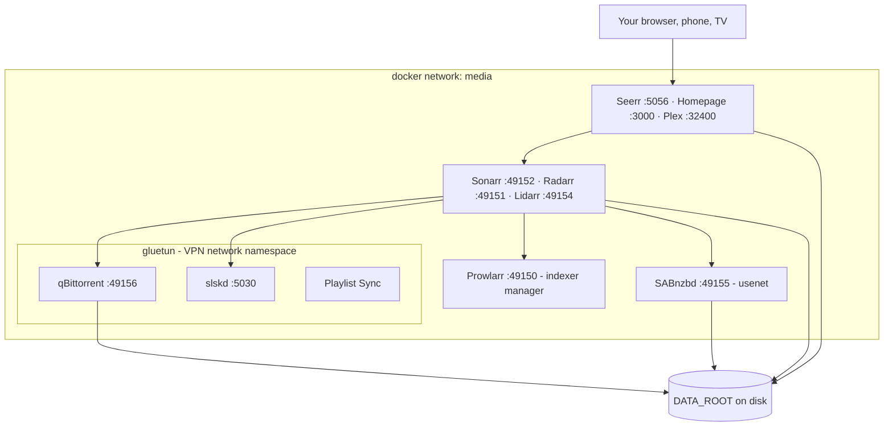
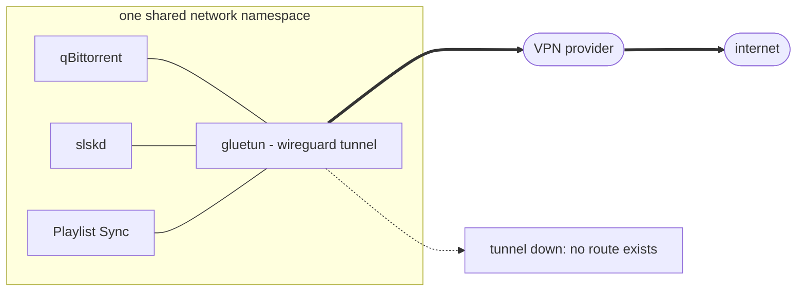
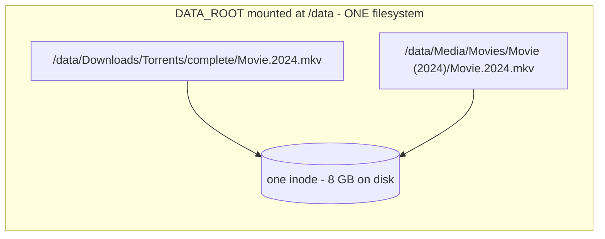
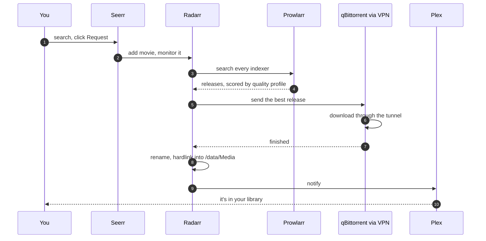
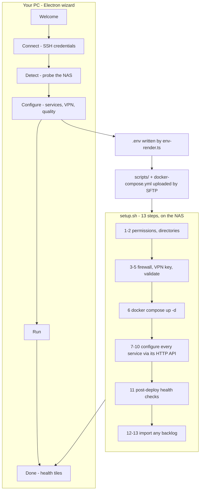
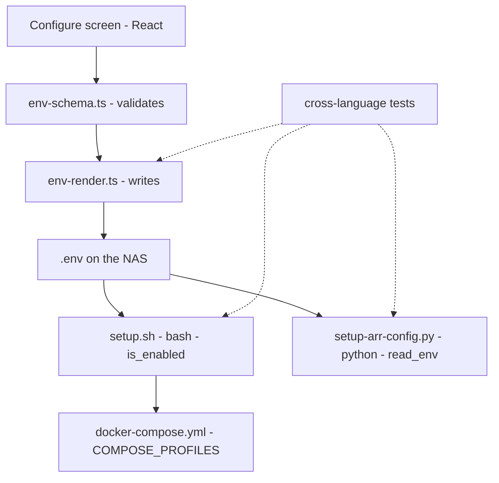
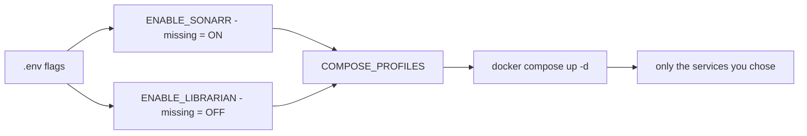

The [Tutorial](tutorial) builds this stack by hand, one layer at a time. This page goes the other direction. It's the finished thing taken apart, so you can see how the pieces relate before you go poking at any one of them.

You don't need to read it to use your stack. It helps a lot when something breaks.

## The Shape Of It

Everything runs as containers on one Docker network called `media`. Three of them are different, and that difference is the most important thing on this page. qBittorrent, slskd, and Playlist Sync have no network of their own. They run *inside* the VPN container's network stack.

Everything published on a port binds to `LAN_IP` specifically, not to `0.0.0.0`. Your stack is reachable from your own network and nowhere else, without you configuring anything.

The port numbers up in the 49150 range look arbitrary because they are. They sit high in the ephemeral range deliberately, well clear of the ports Synology's DSM claims for itself.

## One Namespace, No Leaks

A VPN kill-switch usually means software watching the tunnel and racing to block traffic when it drops. That race is losable. We don't run one.

Instead, qBittorrent has no network interface at all. Compose gives it `network_mode: "container:gluetun"`, so it shares gluetun's network stack the way two processes share one machine's. qBittorrent's `localhost` *is* gluetun's `localhost`.

So when the tunnel drops there's nothing to react to. The route those containers would need simply isn't there. They lose connectivity and wait. Your real IP was never something they could fall back to, because they never had an interface that knew it.

This is also why a few things about the stack look strange until you know the reason:

- qBittorrent's WebUI port is published on the `gluetun` service, not on `qbittorrent`. A container sharing another's namespace can't publish its own ports.
- qBittorrent can't declare `networks:` or `security_opt:` either. It inherits gluetun's.
- Recreating gluetun breaks the three containers welded to it, because the namespace they were attached to stops existing. The installer detects and repairs that automatically. It's the cause behind the "container is marked for removal" error if you ever meet it.

Note: only the download clients route through the VPN. Plex, the arrs, and everything else talk to your LAN directly. Putting Plex behind the VPN would make it unreachable from your own TV.

## Why Everything Shares One /data

Every arr mounts the same single volume, `DATA_ROOT` as `/data`. Not `/downloads` and `/media` as two separate mounts. One.

That looks like a detail. It's the difference between your library holding one copy of every file and holding two.

When Radarr imports a download it creates a hardlink rather than copying. Two paths, two names, one set of bytes. qBittorrent keeps seeding the file it knows about, Plex reads the tidy renamed one, and your disk holds 8 GB rather than 16.

IMPORTANT: hardlinks only work within a single filesystem. If `Downloads` and `Media` land on different volumes the arrs silently fall back to copying. Everything still works, it just costs double the space and a long copy on every import. The installer checks for this and warns you.

There's one wrinkle. qBittorrent mounts a narrower view (`/downloads`) than the arrs do (`/data`). They're looking at the same bytes by different paths, so the arr needs a translation between qBittorrent's idea of where a file is and its own. That's a Remote Path Mapping, and the wizard configures it for you. It's also the thing people most often get wrong by hand, which is exactly why it's automated.

## How A Request Becomes A File

The everyday path, end to end. None of this is invented by the installer, it's how the arr ecosystem works. What the installer does is wire every participant to the others so it happens on the first try.

A few things worth knowing about that sequence:

- **Prowlarr is the only place indexers live.** You add an indexer once and Prowlarr pushes it into Sonarr, Radarr, and Lidarr. You never configure the same tracker three times.
- **Quality profiles decide which release wins**, not download speed or seed count alone. That's the scoring Recyclarr syncs from the TRaSH guides, and you can change it any time from [Quality Profiles](quality-profiles).
- **The notify step is why your library updates immediately** rather than whenever Plex next feels like scanning.
- **If step 8 never happens**, the download completed but nothing imported it. That's the most common failure by a wide margin, and it's nearly always the path mapping or a permissions problem on the destination.

## What The Installer Actually Does

The wizard is an Electron app on your PC. It installs nothing on your PC beyond itself. Everything it does happens over SSH on the NAS.

Step 7 is where most of the value sits. The wizard doesn't hand you a running stack and a list of things to go set up. It logs into each service's own HTTP API and configures it: root folders, download clients, path mappings, quality profiles, the Prowlarr-to-arr connections, subtitle providers, the Plex library and its notification hook.

Everything in step 7 is idempotent. Re-running the installer over a working stack skips whatever is already correct, which makes "just run it again" a safe first move rather than a risky one.

## The .env Contract

One file decides what your stack is, and that's `.env` on the NAS. What makes it interesting is how many different languages have to agree about it.

Four layers, three languages, one file format. Each layer has its own idea of how to parse a value and what counts as enabled, and any disagreement between them is a bug that's close to invisible. A flag the TypeScript writer treats as on and bash treats as off means a service the wizard promises and never installs, with no error anywhere.

So those parsers are pinned against each other by tests that run the *real* bash and Python, not reimplementations of them. If `is_enabled` in setup.sh ever disagrees with `isEnabled` in TypeScript about a value like `" off "` or `1` or an empty string, CI fails.

There's a second rule those tests enforce, and it's worth knowing if you ever add a service. An opt-in flag has to be *written* even when it's off. A key that renders as absent rather than `false` reads downstream as "not enabled", which is the right answer for the wrong reason, and it stops being right the moment somebody changes a default.

## Opt-In Services And Compose Profiles

Most services are on by default. A few stay off until you ask, because they're heavy, need their own account, or only suit some people.

The two kinds behave differently when a key is *missing*, which matters every time you upgrade an existing install:

Default-on services - a missing `ENABLE_` key counts as ON. Your `.env` predates the flag, so the service was already there and stays there.

Opt-in services - a missing key counts as OFF. Upgrading never quietly installs a new heavyweight container you didn't ask for.

Compose profiles are what make that work. Every service carries a `profiles:` key, `setup.sh` builds `COMPOSE_PROFILES` from your flags, and `docker compose up -d` starts that set and nothing else. Turning a service off later removes its container on the next run rather than leaving it orphaned.

Opt-in at time of writing: Soulseek, Playlist Sync, [Live TV](live-tv), and [Librarian](storage).

## Where To Look When It Breaks

A rough map from symptom to layer:

Nothing is reachable at all - the containers didn't start. Check `docker ps` and step 6 in the install log.

One service is unreachable - that container is unhealthy. Check `docker logs <name>`.

Downloads finish but never appear in your library - the import step. Path mapping or permissions, covered in [Downloads & VPN](downloads-and-vpn).

Downloads never start - indexer or download-client wiring, covered in [Indexers](indexers).

Everything works but the VPN is down - qBittorrent goes quiet by design. It isn't broken, that's the kill-switch doing its job.

Disk filling up - [Librarian](storage) will tell you what's eating it.

The installer's Help modal indexes these by symptom, and the diagnostics bundle it can collect gathers the logs for all of them into one file.
