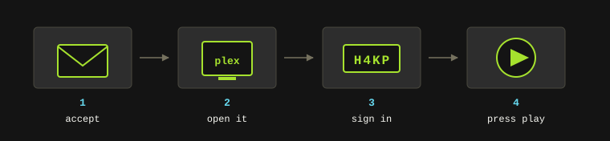
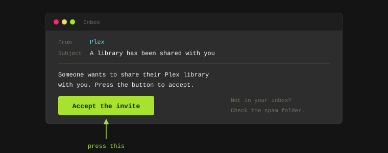
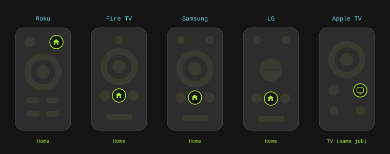
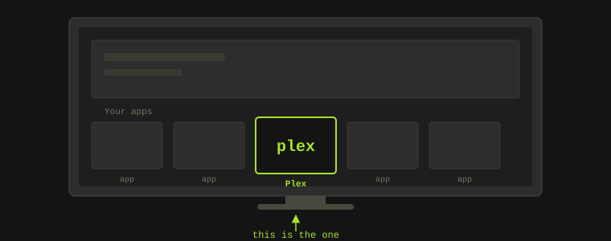
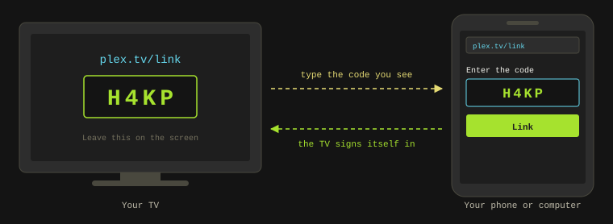
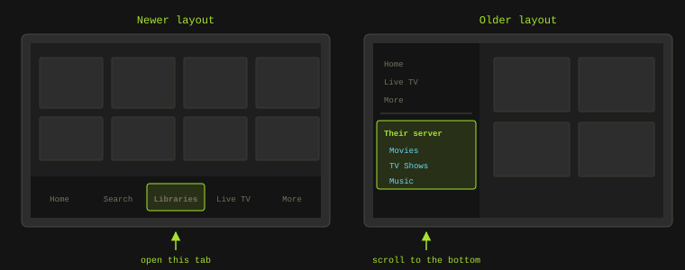

This page is written for the person **receiving** the invite, not the person running
the server. If a friend or a family member has shared their Plex library with you,
this walks you through the whole thing, from the email to pressing play.

It assumes you've never set anything like this up before. Nothing here needs a
computer, and nothing here needs you to understand what a server is. Set aside about
ten minutes, and have your phone next to you for one step in the middle.

<figure>

<figcaption class="figure-caption">Four steps, and only one of them involves typing.</figcaption>
</figure>

## What You Need

- Your TV, with the Plex app on it.
- The invite email.
- Your phone or a computer, just for one sign-in step.
- The Wi-Fi your TV is already using. There's nothing new to set up there.

The only thing you'll ever type on the TV is a four-character code, and even that is
optional if you'd rather use your phone.

## Step 1: Accept the Invite

<figure>

<figcaption class="figure-caption">The email you're looking for. The button is the whole of step one.</figcaption>
</figure>

1. **Find the email.** It comes from Plex and says someone wants to share their library with you. Check your spam or junk folder if it isn't in your inbox, because it lands there more often than it should.
2. **Press the button in the email** that accepts the invitation.
3. **Sign in, or make an account.** If you've never used Plex before, this is where you create one. You can use "Continue with Google" or "Continue with Apple" if you'd rather not invent another password.
4. That's the invite accepted. You should be able to see their library right away in the web page that opens.

Note: If the email never turns up at all, you can accept without it. Go to
`app.plex.tv` in any web browser, sign in, then open Settings -> Manage Library
Access and look under "Library Invitations Received". Accept it with the checkmark.

## Step 2: Open Plex on Your TV

Every TV puts its apps in a slightly different place. Find your brand below. If you're
not sure what you've got, the name is usually printed on the front of the TV, and the
remote is a giveaway too.

<figure>

<figcaption class="figure-caption">Roughly where Home sits on the common remotes. Models vary, so treat this as a hint rather than a map. It's nearly always a little house, and Apple is the one exception.</figcaption>
</figure>

- [Samsung](#samsung)
- [LG](#lg)
- [Roku Sticks and Roku TVs](#roku-sticks-and-roku-tvs) (TCL, Hisense, Sharp, Philips, onn)
- [Amazon Fire TV](#amazon-fire-tv) (Toshiba, Insignia, some Hisense)
- [Google TV and Android TV](#google-tv-and-android-tv) (Sony, TCL, Hisense, Philips, Nvidia Shield)
- [Vizio](#vizio)
- [Hisense](#hisense)
- [Apple TV](#apple-tv)
- [Xbox and PlayStation](#xbox-and-playstation)

Whichever one you have, you're hunting for the same thing.

<figure>

<figcaption class="figure-caption">Press Home, then look along your row of apps. Plex is the one you want.</figcaption>
</figure>

### Samsung

1. Press the **Home** button on the remote (the little house icon).
2. Your apps run along the bottom of the screen. Look along that row for **Plex** and open it.
3. If it isn't in the row, choose **"Apps"**, pick the magnifying glass, and type `Plex`.

### LG

1. Press the **Home** button (the house icon). If you have the pointer remote, aka the Magic Remote, it's the button in the middle.
2. Your apps sit in the bar along the bottom. Scroll along it and open **Plex**.
3. If it isn't in the bar, open **"Apps"** and search for `Plex`.

### Roku Sticks and Roku TVs

This covers the Roku Express and Streaming Stick, plus every TV with Roku built in.
TCL, Hisense, Sharp, Philips, and onn all make them.

1. Press **Home** (the house icon) on the purple Roku remote.
2. Your channels are the grid of tiles on the right. Arrow across to **Plex** and press OK.
3. New channels land at the bottom of that grid, so scroll down if you don't spot it near the top.

### Amazon Fire TV

This covers the Fire TV Stick and Cube, plus TVs with Fire TV built in. Toshiba,
Insignia, some Hisense and Pioneer sets, and Amazon's own TVs all use it.

1. Press **Home** on the remote.
2. Move up to the **"Your Apps"** row and arrow along it to **Plex**.
3. You can also hold the microphone button and just say "Plex", which skips the hunting.

### Google TV and Android TV

This is the biggest group. Most Sony, TCL, Hisense, Philips, and Sharp TVs sold in the
last few years run one of these, and so do the Google TV Streamer, the Chromecast with
Google TV, and the Nvidia Shield.

1. Press **Home**.
2. Go to the **"Apps"** tab along the top and open **Plex**.
3. The microphone button works here too. Hold it and say "open Plex".

### Vizio

Vizio TVs run SmartCast, which keeps its apps in a row rather than in a store you
browse.

1. Press the **Home** button. On older remotes it's the **"V"** button.
2. Arrow along the row of apps to **Plex** and press OK.

### Hisense

Hisense ships two different systems, so check which one you have. Some of their sets
run Google TV, in which case use the [Google TV and Android TV](#google-tv-and-android-tv)
steps above. The rest run Hisense's own system, called VIDAA.

On VIDAA, press **Home**, then arrow along the app row at the bottom to **Plex**.

### Apple TV

This means the little black box that plugs into your TV, not the Apple TV app.

1. Press the **TV** button on the remote to get to the home screen.
2. Move to the **Plex** icon and press the touchpad.

Note: Plenty of smart TVs have an app called "Apple TV" built into them. That's a
different thing, and Plex won't be inside it.

### Xbox and PlayStation

Both have a proper Plex app, and if a console is already plugged into the TV it's
often the quickest route.

- Xbox One, Series S, and Series X - open **"My games & apps"**, then **"Apps"**, and pick Plex.
- PlayStation 4 and 5 - Plex sits in your library alongside your games. Open it from there.

## Step 3: Sign In on the TV

This is the part people expect to be painful. It isn't, because you never type your
password on the TV.

<figure>

<figcaption class="figure-caption">The TV shows a code. You type it on your phone. The TV catches up on its own.</figcaption>
</figure>

1. Open the **Plex** app on the TV.
2. Choose **"Sign In"**.
3. The TV shows a **four-character code**, something like `H4KP`. Leave it on the screen.
4. On your phone or computer, open a web browser and go to `plex.tv/link`.
5. Sign in with the Plex account from Step 1, if it asks you to.
6. Type in the four characters from the TV and submit them.
7. Within a few seconds the TV signs itself in. You don't have to press anything on it.

Note: Those codes expire after a few minutes. If the site says the code is wrong or
expired, go back to the TV, come out of the sign-in screen and into it again, and use
the fresh code it gives you.

## Step 4: Find Their Library

This is the step that trips most people up. When Plex opens, the home screen is mostly
Plex's own movies and channels, which isn't what you're here for. Your friend's
library lives somewhere else in the app.

Plex has been redesigning its TV apps through 2026, so you'll see one of two layouts.

**The newer layout** puts a row of tabs along the bottom or the side, one of which is
**"Libraries"**. Open that, and their libraries are listed under the name of their
server, something like "Doug's Media Server". Movies, TV Shows, and Music are usually
separate entries under it.

**The older layout** has a menu that slides out from the side. Press left on the
remote to open it, or look for the "hamburger" button, which is three stacked lines.
Scroll past your own things to the bottom, and their server name is sitting there with
its libraries underneath.

<figure>

<figcaption class="figure-caption">Where the shared library hides in each layout. The name you're hunting for is theirs, not yours.</figcaption>
</figure>

Either way, once you've found it: open a library, pick something, and press play.
That's the whole job done.

Tip: Most versions of the app let you pin or favorite a library so it turns up on the
home screen next time. It's worth doing on the first evening, because it saves you the
hunt every time after that.

If anything on the TV doesn't match what you're reading here, tell whoever invited you
exactly what the screen says, word for word. They can see far more from their end than
you can from yours.
